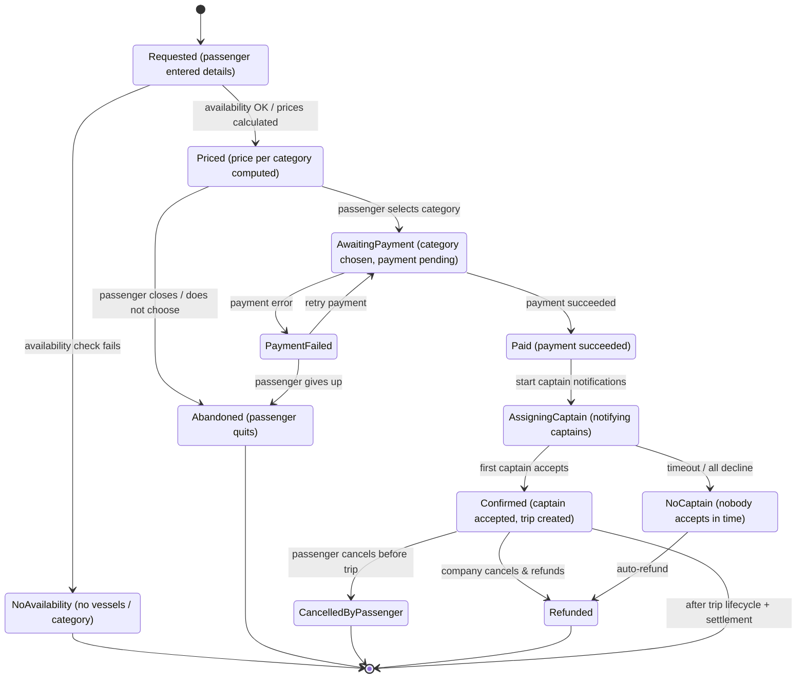

```mermaid
stateDiagram-v2
    [*] --> Requested

    state "Requested (passenger entered details)" as Requested
    state "NoAvailability (no vessels / category)" as NoAvailability
    state "Priced (price per category computed)" as Priced
    state "Abandoned (passenger quits)" as Abandoned
    state "AwaitingPayment (category chosen, payment pending)" as AwaitingPayment
    state "PaymentFailed" as PaymentFailed
    state "Paid (payment succeeded)" as Paid
    state "AssigningCaptain (notifying captains)" as AssigningCaptain
    state "Confirmed (captain accepted, trip created)" as Confirmed
    state "NoCaptain (nobody accepts in time)" as NoCaptain
    state "CancelledByPassenger" as CancelledByPassenger
    state "Refunded" as Refunded

    Requested --> NoAvailability: availability check fails
    Requested --> Priced: availability OK / prices calculated

    Priced --> Abandoned: passenger closes / does not choose
    Priced --> AwaitingPayment: passenger selects category

    AwaitingPayment --> PaymentFailed: payment error
    AwaitingPayment --> Paid: payment succeeded

    PaymentFailed --> AwaitingPayment: retry payment

    Paid --> AssigningCaptain: start captain notifications

    AssigningCaptain --> Confirmed: first captain accepts
    AssigningCaptain --> NoCaptain: timeout / all decline

    Confirmed --> CancelledByPassenger: passenger cancels before trip
    Confirmed --> Refunded: company cancels & refunds

    NoCaptain --> Refunded: auto-refund
    PaymentFailed --> Abandoned: passenger gives up
    NoAvailability --> [*]
    Abandoned --> [*]
    CancelledByPassenger --> [*]
    Refunded --> [*]
    Confirmed --> [*]: after trip lifecycle + settlement
```
