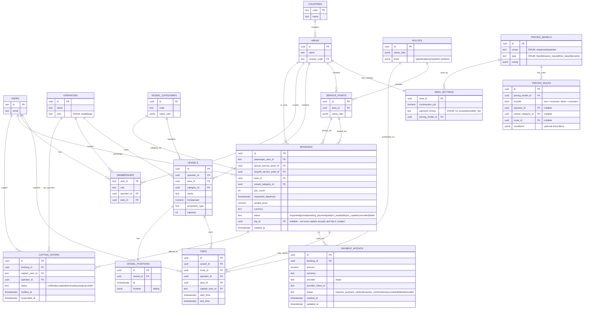

```mermaid
erDiagram
  USERS {
    text id PK
    text email
  }

  OPERATORS {
    uuid id PK
    text name
    text size "ENUM: small|large"
  }

  COUNTRIES {
    text code PK
    text name
  }

  AREAS {
    uuid id PK
    text name
    text country_code FK
  }

  MEMBERSHIPS {
    text user_id FK
    text role
    uuid operator_id FK
    uuid area_id FK
  }

  VESSELS {
    uuid id PK
    uuid operator_id FK
    uuid area_id FK
    uuid category_id FK
    text name
    numeric horsepower
    text propulsion_type
    int capacity
  }

  VESSEL_POSITIONS {
    uuid id PK
    uuid vessel_id FK
    timestamptz at
    jsonb location "lat/lng"
  }

  VESSEL_CATEGORIES {
    uuid id PK
    text code
    jsonb name_i18n
  }

  ROUTES {
    uuid id PK
    jsonb name_i18n
    jsonb limits "speed/capacity/weather windows"
  }

  SERVICE_POINTS {
    uuid id PK
    uuid area_id FK
    jsonb name_i18n
  }

  TRIPS {
    uuid id PK
    uuid vessel_id FK
    uuid route_id FK
    uuid operator_id FK
    uuid area_id FK
    text captain_user_id FK
    timestamptz start_time
    timestamptz end_time
  }

  AREA_SETTINGS {
    uuid area_id PK
    numeric commission_pct
    text payment_timing "ENUM: on_acceptance|after_trip"
    uuid pricing_model_id FK
  }

  PRICING_MODELS {
    uuid id PK
    text scope "ENUM: area|route|operator"
    text type "ENUM: fixed|distance_based|time_based|dynamic"
    jsonb config
  }

  PRICING_RULES {
    uuid id PK
    uuid pricing_model_id FK
    bool include "true = inclusion, false = exclusion"
    uuid operator_id FK "nullable"
    uuid vessel_category_id FK "nullable"
    uuid route_id FK "nullable"
    jsonb conditions "optional extra filters"
  }

  BOOKINGS {
    uuid id PK
    text passenger_user_id FK
    uuid pickup_service_point_id FK
    uuid dropoff_service_point_id FK
    uuid area_id FK
    uuid vessel_category_id FK
    int pax_count
    timestamptz requested_departure
    numeric quoted_price
    text currency
    text status "requested|priced|awaiting_payment|paid|no_availability|no_captain|cancelled|failed"
    uuid trip_id FK "nullable – set once captain accepts and trip is created"
    timestamptz created_at
  }

  PAYMENT_INTENTS {
    uuid id PK
    uuid booking_id FK
    numeric amount
    text currency
    text provider "stripe"
    text provider_intent_id
    text status "requires_payment_method|requires_confirmation|succeeded|failed|refunded"
    timestamptz created_at
    timestamptz updated_at
  }

  CAPTAIN_OFFERS {
    uuid id PK
    uuid booking_id FK
    text captain_user_id FK
    uuid operator_id FK
    text status "notified|accepted|declined|expired|cancelled"
    timestamptz notified_at
    timestamptz responded_at
  }

  VESSELS ||--|| VESSEL_POSITIONS : has

  BOOKINGS ||--o{ CAPTAIN_OFFERS : offered_to
  USERS   ||--o{ CAPTAIN_OFFERS : captain
  OPERATORS ||--o{ CAPTAIN_OFFERS : via_operator

  BOOKINGS ||--o{ PAYMENT_INTENTS : paid_via
  BOOKINGS ||--|| TRIPS : may_spawn
  USERS ||--o{ BOOKINGS : passenger
  SERVICE_POINTS ||--o{ BOOKINGS : pickup_for
  SERVICE_POINTS ||--o{ BOOKINGS : dropoff_for
  VESSEL_CATEGORIES ||--o{ BOOKINGS : category_for
  AREAS ||--o{ BOOKINGS : in_area


  USERS ||--o{ MEMBERSHIPS : has
  OPERATORS ||--o{ MEMBERSHIPS : scopes
  AREAS ||--o{ MEMBERSHIPS : scopes

  OPERATORS ||--o{ VESSELS : owns
  AREAS ||--o{ VESSELS : contains
  VESSEL_CATEGORIES ||--o{ VESSELS : classifies

  VESSELS ||--o{ TRIPS : uses
  ROUTES ||--o{ TRIPS : scheduled_on
  USERS  ||--o{ TRIPS : captains

  ROUTES  ||--o{ SERVICE_POINTS : includes
  AREAS ||--o{ SERVICE_POINTS : contains

  AREAS ||--|| AREA_SETTINGS : has_settings
  PRICING_MODELS ||--o{ AREA_SETTINGS : used_by

  PRICING_MODELS ||--o{ PRICING_RULES : has_rules
  COUNTRIES ||--o{ AREAS : contains

```
