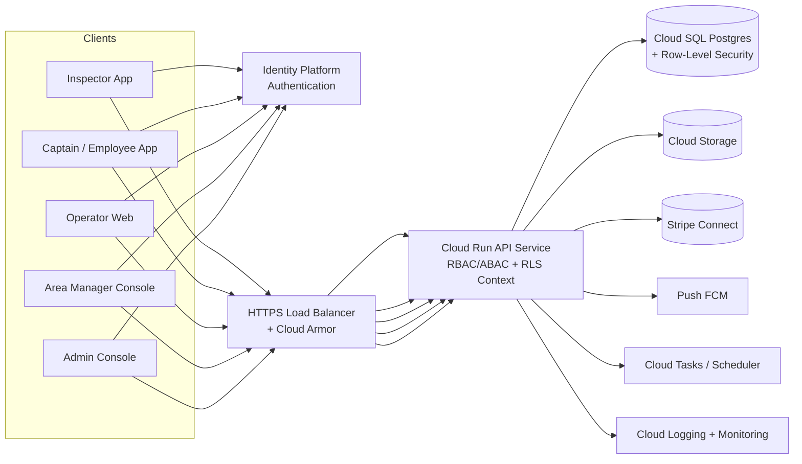

```mermaid
flowchart LR
subgraph Clients
A1[Inspector App]
A2[Captain / Employee App]
A3[Operator Web]
A4[Area Manager Console]
A5[Admin Console]
end

IDP[Identity Platform<br/>Authentication]
GLB[HTTPS Load Balancer<br/>+ Cloud Armor]
API[Cloud Run API Service<br/>RBAC/ABAC + RLS Context]
SQL[(Cloud SQL Postgres<br/>+ Row-Level Security)]
GCS[(Cloud Storage)]
STRIPE[(Stripe Connect)]
TASKS[Cloud Tasks / Scheduler]
FCM[Push FCM]
LOGS[Cloud Logging + Monitoring]

A1 --> GLB --> API
A2 --> GLB --> API
A3 --> GLB --> API
A4 --> GLB --> API
A5 --> GLB --> API
A1 --> IDP
A2 --> IDP
A3 --> IDP
A4 --> IDP
A5 --> IDP

API --> SQL
API --> GCS
API --> STRIPE
API --> FCM
API --> TASKS
API --> LOGS
```
