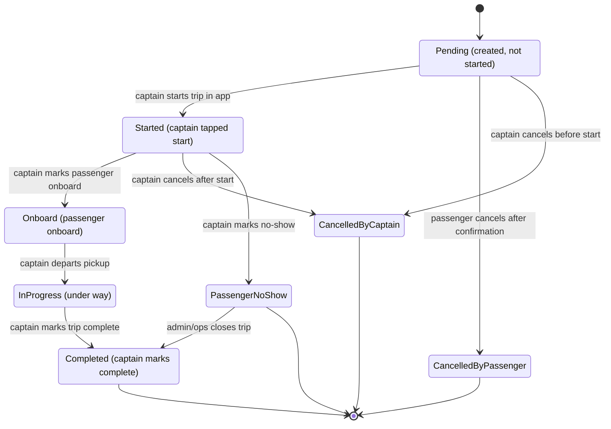

```mermaid
stateDiagram-v2
[*] --> Pending

    state "Pending (created, not started)" as Pending
    state "Started (captain tapped start)" as Started
    state "Onboard (passenger onboard)" as Onboard
    state "InProgress (under way)" as InProgress
    state "Completed (captain marks complete)" as Completed
    state "CancelledByCaptain" as CancelledByCaptain
    state "CancelledByPassenger" as CancelledByPassenger
    state "PassengerNoShow" as PassengerNoShow

    Pending --> Started: captain starts trip in app
    Started --> Onboard: captain marks passenger onboard
    Onboard --> InProgress: captain departs pickup
    InProgress --> Completed: captain marks trip complete

    Pending --> CancelledByPassenger: passenger cancels after confirmation
    Pending --> CancelledByCaptain: captain cancels before start

    Started --> CancelledByCaptain: captain cancels after start
    Started --> PassengerNoShow: captain marks no-show

    PassengerNoShow --> Completed: admin/ops closes trip

    Completed --> [*]
    CancelledByCaptain --> [*]
    CancelledByPassenger --> [*]
    PassengerNoShow --> [*]
```
